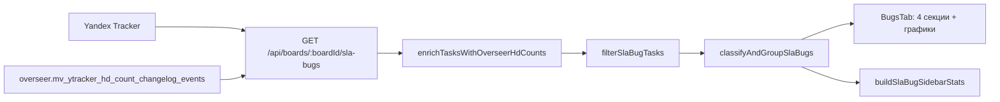

# Вкладка «Баги»: секции, сигналы и функции

Полное описание вкладки **«Баги»** в сайдбаре планера: откуда берутся данные, как задачи попадают в секции, какие метки показываются на карточках, сортировка, статистика и действия.

Краткий каталог только сигналов (для согласования меток): **[SLA_BUGS_SIGNALS.md](./SLA_BUGS_SIGNALS.md)**.

Источник правды в коде: `lib/slaBugs/`, `features/sidebar/components/tabs/BugsTab/`, `app/api/boards/[boardId]/sla-bugs/route.ts`.

---

## Назначение вкладки

Вкладка показывает **открытые SLA-баги** продуктовой команды текущей доски:

- тип **bug**, критичность **P0–P4**, статус не closed;
- поле **«Продуктовая команда»** совпадает с командой доски;
- задачи, уже стоящие на свимлейне текущего спринта, **скрываются** из списка.

Задачи группируются в **4 секции**. На каждой карточке — **один сигнал** (метка риска). По клику на сигнал — попап с метриками, heatmap обращений HD и пояснением.

---

## Поток данных



| Этап | Что делает |
|------|------------|
| Загрузка из Tracker | Открытые баги команды; отдельные запросы для «пришло/закрыто за неделю» |
| Overseer | `hdCount`, `hdGrowth24h`, `hdGrowth7d`, `lastHdAt`, приоритет — из changelog HD |
| Фильтр | Только bug + P0–P4 |
| Классификация | Секция + сигнал + сортировка внутри секции |
| UI | Секции, summary-карточки, bar charts по P0–P4, heatmap по запросу в попапе |

**Heatmap обращений** (в попапе сигнала): `GET /api/issues/:issueKey/hd-weekly-heatmap?createdAt=…&hdCount=…` — недельные суммы `hd_count_delta` из overseer; недостающая часть до текущего `hdCount` добавляется в **неделю создания** задачи.

---

## SLA и дедлайн

Если в Tracker нет поля SLA, дедлайн = `createdAt` + срок решения:

| Приоритет | Срок решения | «Давно просрочен» (только сортировка в «Разобрать») |
|-----------|--------------|-----------------------------------------------------|
| P0 | 1 день | > 3 дн после дедлайна |
| P1 | 7 дней | > 7 дн |
| P2 | 14 дней | > 14 дн |
| P3 | 45 дней (1,5 мес.) | > 30 дн |
| P4 | 180 дней (6 мес.) | > 30 дн |

Метрики: `daysToSla`, `hoursToSla`, `isOverdue`, `overdueDays` — `lib/slaBugs/slaBugMetrics.ts`.

---

## Четыре секции

Секция задаёт **группировку в сайдбаре**. Сигнал на карточке может отличаться.

Порядок проверки для **P3** и **P4**: `Брать сейчас` → `Разобрать` → `Следить` → иначе `Обычные`.

| Ключ | UI | P0–P2 | P3 | P4 |
|------|-----|-------|----|----|
| `take_now` | **Брать сейчас** | Всегда | См. критерии ниже | См. критерии ниже |
| `review` | **Разобрать** | — | Кандидат на понижение | Кандидат на закрытие |
| `watch` | **Следить** | — | Умеренный риск | Умеренный риск |
| `regular` | **Обычные** | — | Без триггеров выше | Без триггеров выше |

### «Брать сейчас» — P3

Любое из условий:

| # | Условие |
|---|---------|
| 1 | Рост HD за 24 ч **≥ 3** |
| 2 | Рост HD за 7 дн **≥ 5** |
| 3 | До SLA **≤ 14 дн**, HD **≥ 4** и «свежая активность» (рост 7d, key_client/sup_priority или last HD ≤ 30 дн) |
| 4 | HD **18–20**, рост 7d **≥ 3** |
| 5 | HD **18–20**, рост 24h **≥ 1** (не «первый контакт»: 24h=1 и hd=1) |
| 6 | **Ключевой клиент**, HD **3–4**, рост 7d **≥ 2** |
| 7 | **Ключевой клиент**, HD **3–4**, рост 24h **≥ 1** (не первый контакт) |
| 8 | **Ключевой клиент**, HD **8–9**, рост 7d **> 0** или до SLA **≤ 14 дн** |
| 9 | **Пуш поддержки** и (рост 24h **≥ 3** или рост 7d **≥ 5**) |

### «Брать сейчас» — P4

| # | Условие |
|---|---------|
| 1 | Рост HD за 24 ч **≥ 3** |
| 2 | Рост HD за 7 дн **≥ 6** |
| 3 | **Ключевой клиент**, HD **3–4**, рост 7d **≥ 2** |
| 4 | **Ключевой клиент**, HD **8–9**, рост 7d **> 0** |
| 5 | **Пуш поддержки** и (рост 24h **≥ 3** или рост 7d **≥ 6**) |

### «Разобрать» — P3

Попадает, если срабатывает **`resolveP3DemoteReason`** (см. подтипы `demote` ниже). Блокировки: key_client, sup_priority, рост 24h/7d, активная работа, HD **≥ 18**.

### «Разобрать» — P4

Попадает, если **`matchesP4CloseReview`**:

- не key_client / sup_priority / активная работа;
- HD **< 11**, рост 7d **= 0**;
- и (**возраст > 90 дн** ИЛИ **просрочен SLA** ИЛИ **до SLA ≤ 21 дн**).

### «Следить» — P3

Любое из условий:

| # | Условие |
|---|---------|
| 1 | Умеренный рост 24h (**≥ 2**) |
| 2 | Слабый рост 24h (P3: 24h=1 при hd **≥ 4**) |
| 3 | Умеренный рост 7d (**≥ 3**) |
| 4 | HD **18–20**, нет роста 24h/7d |
| 5 | **Ключевой клиент** и HD низкий (1–2) |
| 6 | **Ключевой клиент**, HD **3–4**, нет роста |
| 7 | **Пуш поддержки** и HD **≥ 1** |
| 8 | До SLA **15–21 дн**, HD **1–3** |

### «Следить» — P4

| # | Условие |
|---|---------|
| 1 | Умеренный рост 24h (**≥ 2**) |
| 2 | Слабый рост 24h (P4: 24h=1 при hd **≥ 3**) |
| 3 | Умеренный рост 7d (**≥ 4**) |
| 4 | HD **8–10**, нет роста |
| 5 | **Ключевой клиент** и HD низкий |
| 6 | **Ключевой клиент**, HD **3–4**, нет роста |
| 7 | **Пуш поддержки** и HD **≥ 1** |

### «Обычные»

P3/P4, не попавшие в три секции выше.

---

## Сигналы на карточке (13 активных)

На карточке **один** сигнал — с наивысшим приоритетом среди подходящих.

**P0–P2:** если сигнал не подошёл — метка **не показывается**.  
**P3–P4:** в «Обычных» может показаться «Без сигнала».

### Приоритет выбора

1. P3 с правилом demote → всегда **`demote`** (выше hd_* и т.д.).
2. В секции **«Разобрать»** → **`close_p4`** или **`demote`** вне общего порядка.
3. Иначе первый из списка:

```
sharp_growth → growth_24h → save_sla → close_to_upgrade → hd_high →
key_client → sup_priority → hd_medium → hd_low → demote → close_p4 →
no_growth → no_signal
```

### Таблица сигналов

| Ключ | На карточке | Когда ставится |
|------|-------------|----------------|
| `sharp_growth` | **Резкий рост** | Рост HD за 24 ч **≥ 3** (не первый контакт) |
| `growth_24h` | **Рост 24ч** | Рост 24h **≥ 2**; слабый рост (P3: 24h=1, hd≥4; P4: 24h=1, hd≥3); или умеренный рост 7d (P3: ≥3; P4: ≥4) |
| `save_sla` | **Спасти SLA** | Не просрочен; до SLA: P0 **≤ 24 ч**, P1 **≤ 3 дн**, P2 **≤ 7 дн**, P3 **≤ 14 дн** |
| `close_to_upgrade` | **Близко к P↑** | P3: hd 18–20; P4: hd 8–10; ключевой: hd 3–4 или 8–9 |
| `hd_high` | **HD высокий** | Обычный: hd 8–17; ключевой: hd 5–9 |
| `key_client` | **Ключевой** | Поле или тег ключевого клиента |
| `sup_priority` | **Пуш поддержки** | Поле или тег пуша от поддержки |
| `hd_medium` | **HD средний** | Обычный: hd 4–7; ключевой: hd 3–4 |
| `hd_low` | **HD низкий** | Обычный: hd 1–3; ключевой: hd 1–2 |
| `demote` | **Понизить приоритет** | P3 в «Разобрать» / правило demote |
| `close_p4` | **Закрыть P4** | P4 в «Разобрать» |
| `no_growth` | **Нет роста** | hd > 0, нет значимого роста 24h и 7d |
| `no_signal` | **Без сигнала** | Секция «Обычные», hd ≤ 3, нет роста, не «близко к P↑», не ключевой/пуш, не «HD низкий» |

### Убранные сигналы (не показываются)

| Ключ | Было на карточке | Примечание |
|------|------------------|------------|
| `deadline_lost` | Срок потерян | Удалён |
| `deadline_burning` | Срок горит | Покрывается `save_sla` |
| `deadline_soon` | Срок скоро | Окно P3 15–21 дн — только секция «Следить» |
| `decide_fate` | Решить судьбу | Окно P4 ≤ 21 дн — секции «Следить» / «Разобрать» |
| `long_overdue` | Давно просрочен | Только сортировка в «Разобрать» |

### Подтипы «Понизить приоритет» (`demote`)

Текст в тултипе зависит от подтипа:

| Ключ | Описание | Критерий |
|------|----------|----------|
| `low_relevance` | Низкая актуальность | P3, hd **1–3**, нет роста, **> 30 дн** с last HD (или просрочен SLA), возраст **> 30 дн** |
| `stale_p3` | Залежавшийся P3 | P3 **> 180 дн**, hd **< 18**, нет роста, last HD **> 90 дн** назад |

Общие блокировки demote: key_client, sup_priority, рост, активная работа, hd **≥ 18**.

---

## Сортировка внутри секций

| Секция | Порядок (сверху важнее) |
|--------|-------------------------|
| **Брать сейчас** | P0–P2 vs P3/P4 с учётом «сильных» триггеров; затем приоритет; HD ↓; ближайший SLA |
| **Следить** | «Близко к P↑»; рост 24h ↓; рост 7d ↓; key_client; sup_priority; HD ↓ |
| **Обычные** | Приоритет ↑; HD ↓; SLA ↑; задачи без HD внизу |
| **Разобрать** | `close_p4` → `demote` → длительная просрочка → overdueDays ↓ → HD ↑ → без роста выше |

---

## UI и функции вкладки

### Блок «Зона качества» (самый верх)

| Элемент | Значение |
|---------|----------|
| **Зона качества** | Светофор по ZBP: **красная** — есть P0 или активных P1 ≥ 2; **жёлтая** — P0 нет, P1 = 1; **зелёная** — P0 нет и P1 = 0. P2 на цвет не влияет |
| **Нужно закрыть** | Только для жёлтой и красной зоны: «Для {следующая зона} зоны нужно закрыть» + счётчики P0–P2. Для зелёной блок скрыт |

Логика: `lib/slaBugs/qualityZone.ts`, UI: `BugsTabQualityZoneBanner.tsx`.

### Summary-карточки

| Карточка | Значение |
|----------|----------|
| **Пришло за неделю** | Баги с `createdAt` за последние 7 дн (UTC) |
| **Закрыто за неделю** | Баги с `resolvedAt` за последние 7 дн |
| **SLA-риск** | Число задач в секции **«Брать сейчас»** |

### Bar charts по P0–P4

Два графика (пришло / закрыто): столбцы по приоритетам, тултип со списком задач.

### Карточка задачи

- Критичность, SP/TP, **один сигнал** с попапом.
- Поле **«Продуктовая команда»** на карточке (если есть).

### Попап сигнала

| Блок | Содержимое |
|------|------------|
| Заголовок | Название сигнала |
| Метрики | Всего HD, последнее повышение HD, сигнал, ZBP/SLA |
| Heatmap | Обращения HD по неделям (с создания); интерактивные клетки, легенда «Меньше — Больше» |
| Описание | Критерий сигнала (или подтип demote) |

### Действия «Закрыть P4»

Только при сигнале **`close_p4`**, если нет тега решения:

| Действие | Тег Tracker | UI после |
|----------|-------------|----------|
| Отправить на согласование | `closing_candidate` | «На согласовании» + комментарий в задачу |
| Оставить | `bug_in_progress` | «Оставили» |

Workflow **не меняется** — только тег и (для согласования) комментарий.  
API: `POST /api/issues/:issueKey/sla-bug-close-action`.

---

## Поля и источники

| Поле | Tracker / Overseer |
|------|-------------------|
| `incidentSeverity` | P0–P4 |
| `hdCount`, `hdGrowth24h`, `hdGrowth7d`, `lastHdAt` | Overseer (при ошибке — поля Tracker) |
| `keyClient`, `supPriority` | Поля + теги |
| `slaDeadline` | Tracker или расчёт от `createdAt` |
| `productTeam` | Фильтр загрузки по команде доски |
| `trackerTags` | Состояние close P4 (`closing_candidate`, `bug_in_progress`) |

«Первый контакт»: `hdGrowth24h === 1` и `hdCount === 1` — не считается ростом для sharp/moderate.

---

## Пороги конфигурации

Файл `lib/slaBugs/config.ts` (`DEFAULT_SLA_BUG_THRESHOLDS`):

| Параметр | Значение | Назначение |
|----------|----------|------------|
| `p3TakeNowGrowth24h` | 3 | P3 → «Брать сейчас» |
| `p3TakeNowGrowth7d` | 5 | P3 → «Брать сейчас» |
| `p4TakeNowGrowth24h` | 3 | P4 → «Брать сейчас» |
| `p4TakeNowGrowth7d` | 6 | P4 → «Брать сейчас» |
| `p3SlaTakeNowDays` | 14 | P3 SLA → «Брать сейчас» |
| `p3SlaWatchDaysMin/Max` | 15 / 21 | P3 SLA → «Следить» |
| `p4SlaReviewDays` | 21 | P4 → «Разобрать» по SLA |
| `p3CloseToP2HdMin/Max` | 18 / 20 | «Близко к P↑» P3 |
| `p4CloseToP3HdMin/Max` | 8 / 10 | «Близко к P↑» P4 |
| `keyClientCloseToP2HdMin/Max` | 3 / 4 | Ключевой → P2 |
| `keyClientCloseToP1HdMin/Max` | 8 / 9 | Ключевой → P1 |
| `p3DemoteLowRelevance*` | 30 дн, hd≤3 | demote `low_relevance` |
| `p3DemoteStale*` | 180 дн, hd<18, last HD 90 дн | demote `stale_p3` |
| `p4CloseAgeDays` | 90 | P4 → «Разобрать» по возрасту |
| `p4CloseHdMax` | 10 | Порог HD для close review |
| `p3SlaActivityHdMin` | 4 | HD для SLA-триггера «Брать сейчас» |
| `p3SlaFreshnessDays` | 30 | «Свежая активность» по last HD |
| `zbpQualityZoneYellowP1Min` | 1 | ZBP: жёлтая зона (предупреждение) |
| `zbpQualityZoneRedP1Min` | 2 | ZBP: красная зона (фича-фриз) |

---

## API

| Метод | Путь | Назначение |
|-------|------|------------|
| GET | `/api/boards/:boardId/sla-bugs` | Открытые баги, группировка, weekly stats |
| GET | `/api/issues/:issueKey/hd-weekly-heatmap` | Недельный heatmap HD для попапа |
| POST | `/api/issues/:issueKey/sla-bug-close-action` | Тег + комментарий close P4 |

---

## Связанные файлы

| Область | Путь |
|---------|------|
| Классификация | `lib/slaBugs/classifySlaBug.ts` |
| Метрики, SLA, demote, HD-уровни | `lib/slaBugs/slaBugMetrics.ts` |
| Пороги | `lib/slaBugs/config.ts` |
| Парсинг полей | `lib/slaBugs/parseSlaBugFields.ts` |
| Overseer HD | `lib/overseer/hdCountRead.ts` |
| Heatmap | `lib/overseer/hdWeeklyHeatmap.ts`, `hdWeeklyHeatmapRead.ts` |
| Close P4 | `lib/slaBugs/closeP4Actions.ts` |
| Статистика | `lib/slaBugs/sidebarStats.ts`, `lib/slaBugs/qualityZone.ts` |
| UI вкладки | `features/sidebar/components/tabs/BugsTab/` |
| Попап / heatmap | `features/task/components/TaskCard/components/SlaBugSignalTag.tsx`, `SlaBugHdWeeklyHeatmap.tsx` |
| i18n | `lib/i18n/messages/ru.ts` → `sidebar.bugsTab.*` |
| Тесты | `lib/slaBugs/classifySlaBug.test.ts`, `hdWeeklyHeatmap.test.ts`, … |

---

## Тесты

```bash
pnpm test lib/slaBugs/
pnpm test lib/overseer/hdWeeklyHeatmap.test.ts
```

При изменении порогов или критериев — обновить этот документ и **[SLA_BUGS_SIGNALS.md](./SLA_BUGS_SIGNALS.md)**.
